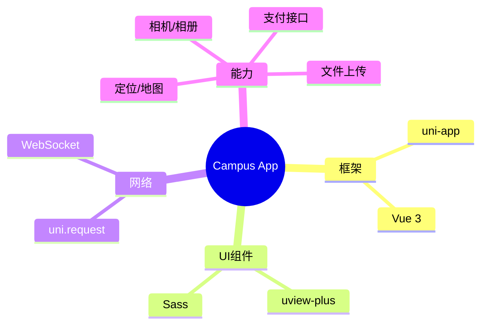

<div align="center">

# 📱 Campus Life App

<!-- 动态打字机效果 -->
<a href="https://github.com/lxxxDD/campus-life-app">
  
</a>

<!-- 核心徽章 -->
<p>
  
  
  
</p>

<!-- 仓库徽章 -->
<p>
  <a href="https://github.com/lxxxDD/campus-life-app">
    
  </a>
  <a href="https://github.com/lxxxDD/campus-life-app/stargazers">
    
  </a>
  <a href="https://github.com/lxxxDD/campus-life-app/commits">
    
  </a>
</p>

<!-- 星际传送门 -->
<div align="center">
  <table>
    <tr>
      <td align="center" width="200">
        <a href="https://github.com/lxxxDD/campus-life-app">
          
        </a>
        <br>
        <b>CampusLifeApp</b>
        <br>
        <sub>触手可及的校园生活</sub>
      </td>
      <td align="center" width="50">⚡</td>
      <td align="center" width="200">
        <a href="https://github.com/lxxxDD/campus-life-server">
          
        </a>
        <br>
        <b>CampusLifeServer</b>
        <br>
        <sub>数据中枢 & 业务大脑</sub>
      </td>
      <td align="center" width="50">⚡</td>
      <td align="center" width="200">
        <a href="https://github.com/lxxxDD/campus-life-admin">
          
        </a>
        <br>
        <b>CampusLifeAdmin</b>
        <br>
        <sub>运筹帷幄的指挥中心</sub>
      </td>
    </tr>
  </table>
</div>

<h3>📲 你的校园生活，触手可及</h3>

<p>
  <a href="#-功能特性">✨ 功能特性</a> •
  <a href="#-技术架构">🛠️ 技术架构</a> •
  <a href="#-快速开始">🚀 快速开始</a> •
  <a href="https://github.com/lxxxDD/campus-life-server">🔗 后端服务</a>
</p>

</div>

---

## 📱 应用预览

```
┌────────────────────────────────────────────────────────────────┐
│  🏠 首页        🛒 市场        🍜 餐饮        👤 我的           │
├────────────────────────────────────────────────────────────────┤
│                                                                │
│    ┌──────────┐    ┌──────────┐    ┌──────────┐               │
│    │  🛍️ 二手  │    │  🍜 点餐  │    │  🔧 报修  │               │
│    │   市场   │    │   系统   │    │   服务   │               │
│    └──────────┘    └──────────┘    └──────────┘               │
│                                                                │
│    ┌──────────┐    ┌──────────┐    ┌──────────┐               │
│    │  📅 活动  │    │  🤖 AI   │    │  💬 消息  │               │
│    │   报名   │    │  助手    │    │   中心   │               │
│    └──────────┘    └──────────┘    └──────────┘               │
│                                                                │
└────────────────────────────────────────────────────────────────┘
```

## ✨ 功能特性 (Features)

| 模块 | 核心功能 | 亮点 |
| :--- | :--- | :--- |
| **🛒 二手市场** | 发布、搜索、收藏、私聊 | 📸 **一键发布**，实时聊天 |
| **🍜 食堂点餐** | 浏览、下单、支付、取餐 | 🥡 **无接触点餐**，智能推荐 |
| **🔧 校园报修** | 报修、进度查询、评价 | 📍 **自动定位**，进度推送 |
| **📅 校园活动** | 浏览、报名、签到 | 🎫 **二维码签到**，活动提醒 |
| **🤖 AI助手** | 问答、导航、查询 | 🧠 **智能对话**，懂你所想 |

## 🛠️ 技术架构 (Tech Stack)



## 🚀 快速开始 (Quick Start)

### 环境准备

- **HBuilderX**: 3.8+ (推荐)
- **Node.js**: 16+

### 运行步骤

```bash
# 1. 📥 克隆项目
git clone https://github.com/lxxxDD/campus-life-app.git

# 2. 📦 安装依赖
npm install

# 3. 🏃 运行项目
# 方式一：命令行
npm run dev:h5

# 方式二：HBuilderX
# 打开项目 -> 运行 -> 运行到浏览器/模拟器
```

## 🔗 生态系统

| 项目 | 描述 | 技术栈 |
|:---:|:---|:---:|
| [🖥️ 后端服务](https://github.com/lxxxDD/campus-life-server) | RESTful API服务 | Spring Boot |
| [📱 移动端](https://github.com/lxxxDD/campus-life-app) | 跨平台移动应用 | uni-app |
| [💻 管理后台](https://github.com/lxxxDD/campus-life-admin) | 运营管理系统 | Vue 3 |

---

<div align="center">

**Made with 💚 by [lxxxDD](https://github.com/lxxxDD)**

</div>
