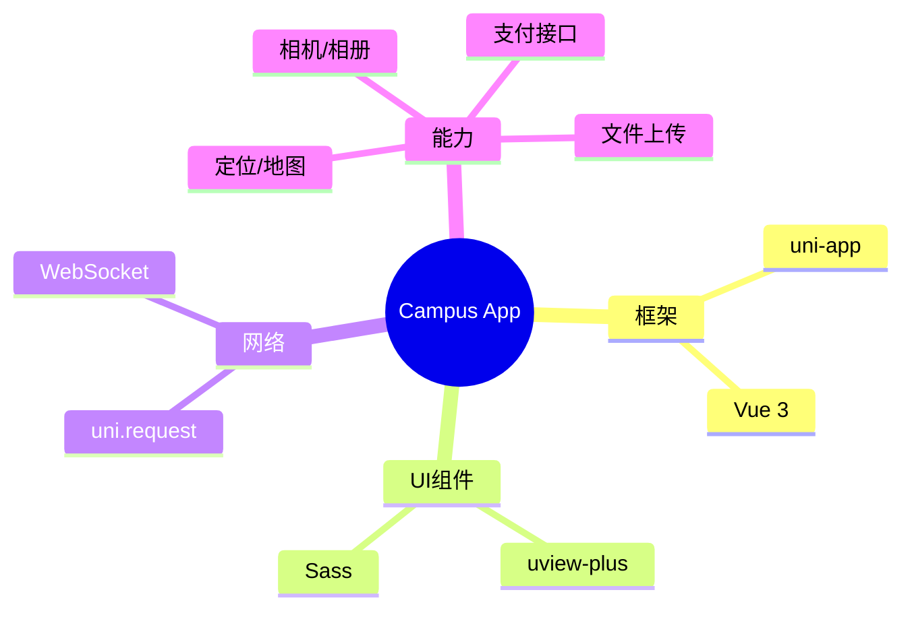

<div align="center">

<!-- 访客统计 -->


<!-- 动态标题 -->
<a href="https://github.com/lxxxDD/campus-life-app">
  
</a>

<br>

<!-- 下载按钮 (模拟) -->
<a href="#">
  
</a>
<a href="#">
  
</a>
<a href="#">
  
</a>

<br>
<br>

<!-- 核心徽章 -->
<p>
  
  
  
</p>

<h3 align="center">📲 你的校园生活，触手可及</h3>

<p align="center">
  <a href="#-应用截图">📱 应用截图</a> •
  <a href="#-功能特性">✨ 功能特性</a> •
  <a href="#-快速开始">🚀 快速开始</a> •
  <a href="https://github.com/lxxxDD/campus-life-server">🔗 后端服务</a>
</p>

</div>

---

## 📱 应用截图 (Screenshots)

> 🎨 **精美UI，极致体验**

<div align="center">
  <table style="border: none;">
    <tr>
      <td align="center">
        
        <br><b>🏠 首页大厅</b>
      </td>
      <td align="center">
        
        <br><b>🛒 二手市场</b>
      </td>
      <td align="center">
        
        <br><b>🔧 校园服务</b>
      </td>
      <td align="center">
        
        <br><b>👤 个人中心</b>
      </td>
    </tr>
  </table>
</div>

## ✨ 功能特性 (Features)

| 模块 | 核心功能 | 亮点 |
| :--- | :--- | :--- |
| **🛒 二手市场** | 发布、搜索、收藏、私聊 | 📸 **一键发布**，实时聊天 |
| **🍜 食堂点餐** | 浏览、下单、支付、取餐 | 🥡 **无接触点餐**，智能推荐 |
| **🔧 校园报修** | 报修、进度查询、评价 | 📍 **自动定位**，进度推送 |
| **📅 校园活动** | 浏览、报名、签到 | 🎫 **二维码签到**，活动提醒 |
| **🤖 AI助手** | 问答、导航、查询 | 🧠 **智能对话**，懂你所想 |

## 🛠️ 技术架构 (Tech Stack)



## 🚀 快速开始 (Quick Start)

### 环境准备

- **HBuilderX**: 3.8+ (推荐)
- **Node.js**: 16+

### 运行步骤

```bash
# 1. 📥 克隆项目
git clone https://github.com/lxxxDD/campus-life-app.git

# 2. 📦 安装依赖
npm install

# 3. 🏃 运行项目
# 方式一：命令行
npm run dev:h5

# 方式二：HBuilderX
# 打开项目 -> 运行 -> 运行到浏览器/模拟器
```

## 🤝 贡献者 (Contributors)

<a href="https://github.com/lxxxDD/campus-life-app/graphs/contributors">
  
</a>

---

<div align="center">

**Made with 💚 by [lxxxDD](https://github.com/lxxxDD)**

</div>
